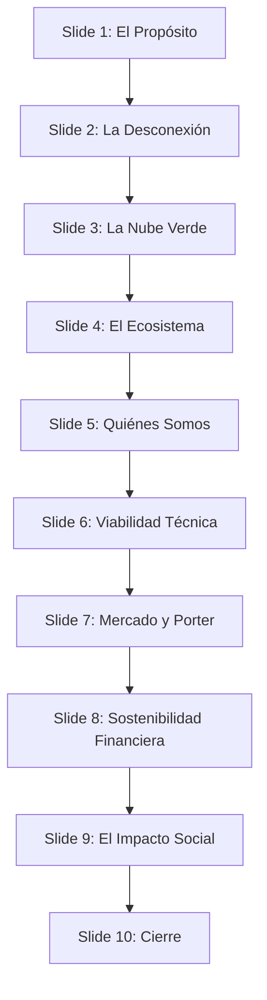

# Guía de Presentación Formal y Humanizada: IQ STACK

Esta guía está estructurada para ayudarte a realizar una presentación de alto impacto ante tu grupo de trabajo o un tribunal. Combina la **rigurosidad técnica y económica** (exigida en entornos formales) con una **narrativa humana y sostenible** (el valor diferencial de IQ STACK).

---

## 🎨 Sistema de Diseño Visual Sugerido (Diapositivas)

Para mantener una coherencia estética moderna, premium y alineada con los valores ecológicos de IQ STACK, utiliza la siguiente paleta de diseño en tu software de presentación (PowerPoint, Keynote o Canva):

*   **Fondo (Dark Mode Premium):** `#0B0F19` (Azul oscuro espacial/charcoal) para evitar la fatiga visual.
*   **Color de Acento Principal (Verde Ecológico/Solar):** `#10B981` (Esmeralda vibrante).
*   **Color de Acento Secundario (Energía/Calidez):** `#F59E0B` (Amarillo solar).
*   **Tipografía:** *Outfit* o *Inter* para títulos (limpia y geométrica), *Roboto* o *Open Sans* para bloques de texto.
*   **Layouts:** Diseños asimétricos con mucho espacio en blanco, tipografías grandes y gráficos minimalistas. Evita sobrecargar con texto.

---

## 📽️ Estructura Diapositiva a Diapositiva

---

### Diapositiva 1: Portada (El Gancho Humano)
*   **Diseño Visual:** Fondo oscuro profundo con una imagen sutil de la infraestructura solar o un cubo en 3D brillante en verde esmeralda. Título principal grande.
*   **Texto en Pantalla:**
    *   **IQ STACK**
    *   *Hosting Ecológico & Control Solar de Alto Rendimiento.*
    *   "Tecnología que funciona, valores que importan."
*   **El Discurso (Speech):**
    > "Buenos días a todos. Hoy queremos hablar de algo invisible pero con un impacto gigante. Cada vez que enviamos un correo, subimos un archivo a la nube o visitamos una web, consumimos energía. De hecho, internet contamina hoy en día lo mismo que toda la industria de la aviación mundial. Pero digitalizar un negocio o una ONG local no debería costar el planeta, ni tampoco requerir que seas un ingeniero de software. Por eso hemos creado **IQ STACK**: una alternativa de hosting real, verde y, sobre todo, humana."

---

### Diapositiva 2: El Problema (La Desconexión del Sector)
*   **Diseño Visual:** Tres columnas limpias con iconos representativos en tono gris/naranja apagado.
*   **Texto en Pantalla:**
    1.  **Huella Invisible:** Centros de datos tradicionales impulsados por energías contaminantes.
    2.  **Soporte Deshumanizado:** Teléfonos automáticos y chatbots infinitos que frustran al usuario.
    3.  **Complejidad Técnica:** Barreras y paneles incomprensibles para PYMEs y ONGs locales.
*   **El Discurso (Speech):**
    > "¿Cuál es el panorama real al que se enfrenta una panadería local o una pequeña asociación de Benicarló cuando quiere crear su web? Se topa con tres muros. El primero es ecológico: la nube tradicional es altamente contaminante. El segundo es la frialdad corporativa: cuando algo falla, te atiende un chatbot programado o te ponen en una cola de soporte interminable. Y el tercero es la complejidad: interfaces llenas de términos técnicos que asustan a cualquiera. Sentimos que la tecnología se ha desconectado de las personas."

---

### Diapositiva 3: La Solución (Nuestra Propuesta de Valor)
*   **Diseño Visual:** Un mockup del dashboard de IQ STACK mostrando la gráfica solar interactiva y la tarjeta 3D de CO₂ evitado. Resaltes en verde esmeralda.
*   **Texto en Pantalla:**
    *   **Hosting 100% Verde:** Servidores alimentados directamente por placas solares y baterías.
    *   **Panel de Control Intuitivo:** Visualización en tiempo real del impacto ecológico (CO₂ evitado y árboles equivalentes).
    *   **Soporte Humano (Cero Bots):** Trato directo cara a cara con el equipo técnico.
*   **El Discurso (Speech):**
    > "La solución que proponemos en IQ STACK no es simplemente vender espacio en un disco duro; es ofrecer un acompañamiento digital sostenible. Ofrecemos un hosting de alto rendimiento impulsado por energía solar. Diseñamos un panel de control interactivo donde el cliente puede ver, de forma supersencilla, cuántos kWh consume y cuánto CO₂ está ahorrando al planeta en tiempo real. Y lo más importante: cuando necesitan ayuda, no abren un ticket que responde una máquina; hablan directamente con nosotros."

---

### Diapositiva 4: La Infraestructura Ecológica (El Flujo Solar)
*   **Diseño Visual:** Un diagrama de flujo minimalista (Sol ➔ Placas ➔ Baterías ➔ Servidores) y mención a la economía circular.
*   **Texto en Pantalla:**
    *   **Hardware Reacondicionado:** Reducción de la huella de fabricación mediante economía circular.
    *   **Software Optimizado:** Servidores Linux de bajo consumo con caché eficiente para minimizar ciclos de procesamiento.
    *   **Autonomía Energética:** Integración de baterías para garantizar servicio ininterrumpido 24/7.
*   **El Discurso (Speech):**
    > "Para que nuestro hosting sea verdaderamente ecológico, aplicamos la sostenibilidad en tres niveles. En el hardware, utilizamos servidores reacondicionados de bajo consumo, dándole una segunda vida útil a los equipos y reduciendo la basura electrónica. En el software, optimizamos cada línea de código en servidores Linux para que consuman el mínimo de recursos y energía. Y en la alimentación eléctrica, el flujo va directamente del sol a nuestras placas y baterías. Cerramos el círculo de principio a fin."

---

### Diapositiva 5: El Equipo Promotor (El Factor Humano)
*   **Diseño Visual:** Cuatro tarjetas limpias con los perfiles complementarios de los fundadores.
*   **Texto en Pantalla:**
    *   **Unai Arnau (CEO):** Visión Estratégica & DevOps.
    *   **Marco Sorlí (CTO):** Inteligencia Artificial & Backend SQLite.
    *   **Hugo Matías (CMO):** Ciberseguridad & Estrategia Comercial.
    *   **Andrei Chivu (CFO):** Gestión Económica & Viabilidad Financiera.
*   **El Discurso (Speech):**
    > "Detrás de IQ STACK estamos cuatro compañeros que compartimos una visión técnica y social común. Unai lidera la estrategia y la gestión de la infraestructura. Marco, nuestro CTO, se encarga de la arquitectura lógica de las bases de datos y la integración inteligente. Hugo protege el sistema mediante auditorías de ciberseguridad y lidera el marketing. Y Andrei controla que los números cuadren para que el proyecto sea viable a largo plazo. Nos une la pasión por la informática y el deseo de aportar algo positivo a nuestro entorno."

---

### Diapositiva 6: Arquitectura y Robustez Técnica
*   **Diseño Visual:** Diagrama de bloques que ilustre la Separación de Responsabilidades (SoC). Frontend SPA en un lado, API intermedia, y SQLite portable en el otro.
*   **Texto en Pantalla:**
    *   **Arquitectura Limpia (Clean Architecture):** Separación estricta de la UI y la lógica de datos.
    *   **Persistencia Local Inteligente:** Sesiones fluidas con almacenamiento local para usuarios recurrentes.
    *   **Base de Datos Autocontenida:** SQLite portable para agilizar despliegues, copias de seguridad y migraciones sin fricciones.
*   **El Discurso (Speech):**
    > "Queremos que el sistema no solo sea bonito, sino técnicamente impecable. Hemos diseñado el software siguiendo la regla de la separación estricta de responsabilidades. La interfaz de usuario es reactiva y ligera, mientras que el backend procesa las solicitudes de manera robusta. Usamos SQLite como base de datos autocontenida, lo que nos permite un rendimiento fantástico para nuestro público objetivo, despliegues inmediatos sin servidores externos complejos y backups sumamente fáciles de transportar."

---

### Diapositiva 7: Mercado y Diferenciación (Análisis Porter/DAFO)
*   **Diseño Visual:** Una matriz comparativa de IQ STACK frente a los gigantes del hosting low-cost.
*   **Texto en Pantalla:**
    *   *Competidores Tradicionales:* Precios gancho con subidas sorpresa, servidores sucios y soporte automatizado.
    *   *IQ STACK:* Precios transparentes y estables, energía solar demostrable, soporte directo con videollamadas mensuales de asesoramiento.
    *   *Público Objetivo:* PYMEs locales, startups y ONGs con compromiso ecológico.
*   **El Discurso (Speech):**
    > "Si nos comparamos con los gigantes del hosting, no competimos por volumen, competimos por valor. En lugar de ofrecer tarifas gancho baratas que luego suben sin aviso, ofrecemos tarifas transparentes. En lugar de un soporte frío, ofrecemos cercanía: los clientes tienen derecho a una videollamada mensual de seguimiento para ayudarles a entender y optimizar su sitio web. Nos enfocamos en ese 80% de usuarios que, según las encuestas, valora el trato humano y el compromiso medioambiental por encima del precio más bajo."

---

### Diapositiva 8: Sostenibilidad Financiera (Números Clave)
*   **Diseño Visual:** Un gráfico lineal del Umbral de Rentabilidad (Break-Even) y un resumen del plan presupuestario.
*   **Texto en Pantalla:**
    *   **Capital Social Inicial:** 4.000 € (Autofinanciación, 1.000 € por socio).
    *   **Distribución de Inversión:** 60% Hardware/Energía, 15% Marketing, 15% Legal, 10% Maniobra.
    *   **Punto Muerto:** Alcanzado en el Mes 6.
    *   **Previsión Año 1:** Beneficio neto positivo con estructura de costes fijos mínimos.
*   **El Discurso (Speech):**
    > "Un proyecto sostenible también debe ser económicamente viable. Nos constituimos como una Sociedad Limitada aportando 1.000 euros cada uno, evitando deudas bancarias iniciales para mantener la independencia financiera. El 60% de este capital se destina a la infraestructura física de energía y servidores. Nuestras proyecciones financieras demuestran que alcanzamos el umbral de rentabilidad en el mes 6 de operaciones, cerrando el primer ejercicio con beneficios netos. Demostramos que la ecología y el beneficio mutuo pueden ir de la mano."

---

### Diapositiva 9: Impacto Social e Inclusión
*   **Diseño Visual:** Fondo con iconos en tono verde claro de personas colaborando.
*   **Texto en Pantalla:**
    *   **Colaboración con ONGs:** Tarifas reducidas y apoyo tecnológico prioritario.
    *   **Acompañamiento Digital:** Formación práctica incluida en los planes para reducir la brecha digital.
    *   **Alianza con Estudiantes:** Programas de tutoría y facilidades para proyectos académicos de sistemas.
*   **El Discurso (Speech):**
    > "Finalmente, nuestro tercer pilar es el impacto social. Creemos en devolver parte de nuestro éxito a la comunidad. Ayudamos a ONGs locales a digitalizarse aplicando tarifas ajustadas a sus presupuestos y ayudándoles con la configuración. No queremos que la falta de presupuesto impida que una gran iniciativa social tenga visibilidad en internet. Además, apoyamos a estudiantes que, como nosotros, necesitan desplegar sus prototipos y encontrar un ecosistema que los entienda y apoye."

---

### Diapositiva 10: Conclusión (El Mensaje para Recordar)
*   **Diseño Visual:** Eslogan centrado en tipografía grande y limpia. Los emails de contacto de los cuatro fundadores abajo de forma elegante.
*   **Texto en Pantalla:**
    *   **IQ STACK**
    *   *La nube que necesitas, la huella que queremos evitar.*
    *   www.iqstack.es | contacto@iqstack.es
*   **El Discurso (Speech):**
    > "Para concluir, queremos dejaros con una reflexión. La digitalización es el futuro, pero no puede hacerse a cualquier precio. En IQ STACK hemos demostrado que se puede crear un hosting que cuida el planeta mediante energía solar, que trata a los clientes como personas y que es económicamente rentable. Os invitamos a formar parte de este cambio. Muchas gracias por vuestro tiempo, y quedamos abiertos a cualquier pregunta que tengáis."

---

## 💡 Consejos para la Exposición Oral (Humanizar el tono)

1.  **Habla desde la empatía, no desde el manual:** Cuenta la historia de cómo surgió el proyecto (en clase, viendo los dolores de pequeños comercios). Eso genera una conexión inmediata con la audiencia.
2.  **Utiliza metáforas cotidianas:** En lugar de hablar de "ancho de banda y caching", di "hacemos que los datos viajen por una autopista directa para que el servidor consuma la mitad de luz".
3.  **Mantén la naturalidad:** Al exponer en un grupo de trabajo, evita leer las notas. Mantén el contacto visual y gesticula de forma relajada pero profesional.
4.  **Usa datos reales de tu panel:** Si puedes, muestra un segundo el panel funcionando en localhost. Un minuto de demostración interactiva vale más que mil diapositivas teóricas.
